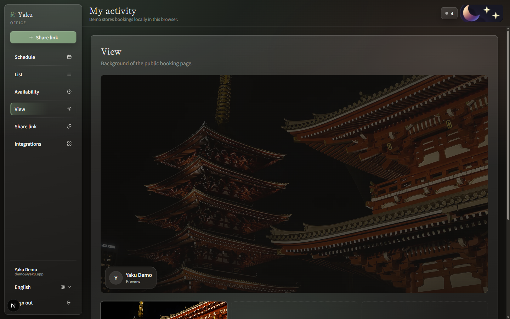

<p align="center">
  
</p>

<h1 align="center">Yaku (約)</h1>

<p align="center">
  <strong>Open-source scheduling</strong> — a lightweight Calendly alternative.<br />
  Guest booking, host office, and a public link. Local-first today; cloud next.
</p>

<p align="center">
  <a href="https://github.com/canyando4699-pixel/yaku">GitHub</a>
  ·
  UI: <strong>English</strong> (DE / JA available)
</p>

**約 (yaku)** means agreement / appointment / a promise kept.

---

## One appointment. No bloat.

Yaku turns open time into real appointments. Guests pick a type, date, and slot on your booking link. Hosts manage everything in a dark/light **office dashboard** — schedule, list, availability (weekly hours, date overrides, holidays), appearance, and share.

Lightweight, open source, self-hostable. The demo is **local-first** (browser `localStorage`). Production will move to Vercel + Supabase, then email, calendar sync, and Calendly-parity office IA.

---

## Preview

### Landing

Cinematic scroll story — intro brand lockup, mid product sights, and a CTA chapter into the demo.


Mid chapter with product story and feature sights:


### Guest booking

Public booking flow (`/b/demo`) with event types, timezone, date, and time slots — liquid-glass card on a temple night backdrop.


### Host office

Host dashboard (`/host`) with theme toggle, language switcher, and liquid-glass UI:

| Schedule | List |
| --- | --- |
|  |  |

| Availability | View |
| --- | --- |
|  |  |

| Share link |
| --- |
|  |

### Sign in

Local auth for the demo host account:


---

## What’s included

Early MVP — default UI language **English** (DE / JA via switcher):

- **Landing** — cinematic scroll chapters (intro / mid / CTA)
- **Guest booking** (`/b/demo`) — event types, guest timezone, weekly series option
- **Guest manage** (`/b/demo/m/[bookingId]`) — cancel / reschedule + `.ics` download
- **Local auth** (`/login`, `/signup`) — demo: `demo@yaku.app` / `yaku123`
- **Host office** (`/host`)
  - **Schedule** — Fantastical-style day / week / month / year calendar
  - **List** — searchable booking table
  - **Availability** — Calendly-style tabs: weekly hours, date overrides, German holidays; buffers, notice, event types, series
  - **View** — booking-page background
  - **Share link** — copy / open public booking URL
  - **Integrations** — placeholder for Google / Apple calendar
  - Dark / light theme + liquid-glass controls
- **Local-first** storage in the browser

---

## Coming next

**Soon (local, no cloud required)**

- Calendly-style **office sidebar** (event types / one-off links / polls, meetings, availability)
- **Meeting limits** (global caps across event types)
- **One-off / single-use** booking links

**Then (needs a backend)**

- **Vercel** deploy + README split for local demo vs production
- **Supabase** auth + bookings so guests and hosts are not stuck in one browser
- Per-host public slug `/b/[slug]`
- **Email** confirmation (Resend), then reminders
- **Google Calendar** busy/create (Outlook later)
- Group events, routing, workflows, payments, teams / admin center

---

## Develop

```bash
cp .env.example .env.local
npm install
npm run dev
```

Open [http://localhost:3000](http://localhost:3000). Host office: [http://localhost:3000/host](http://localhost:3000/host) after sign-in.

---

## Security / GitHub

**Do not commit or push:**

- `.env`, `.env.local`, or any real env files
- API keys, database URLs, service-account JSONs
- Private certificates (`*.pem`, `*.key`)

Only `.env.example` with placeholders belongs in the repo. Before every push:

```bash
git status
git diff
```

If unsure: **do not** stage the file.
