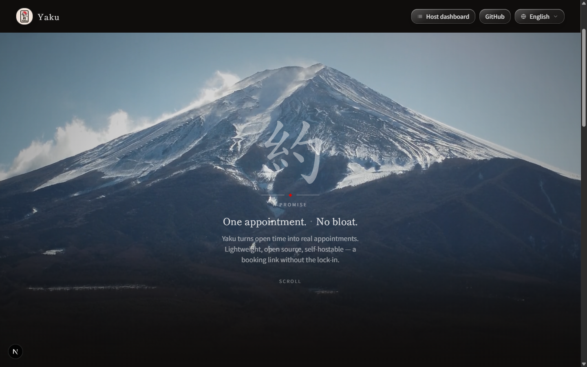
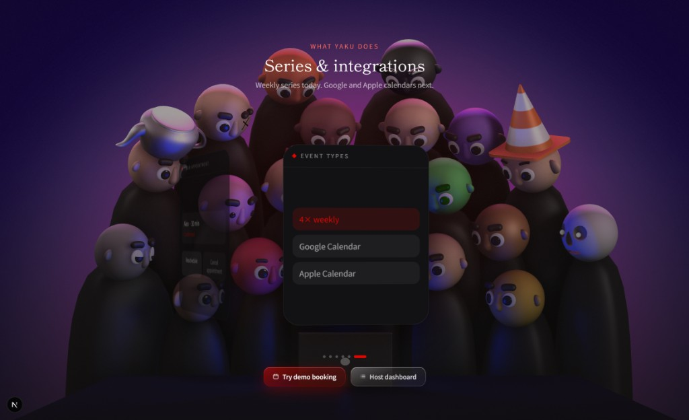
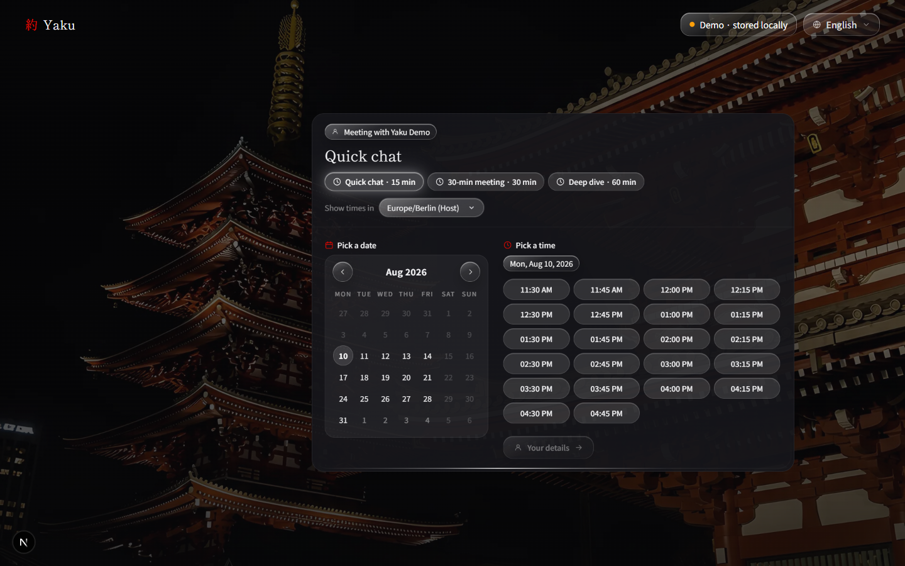
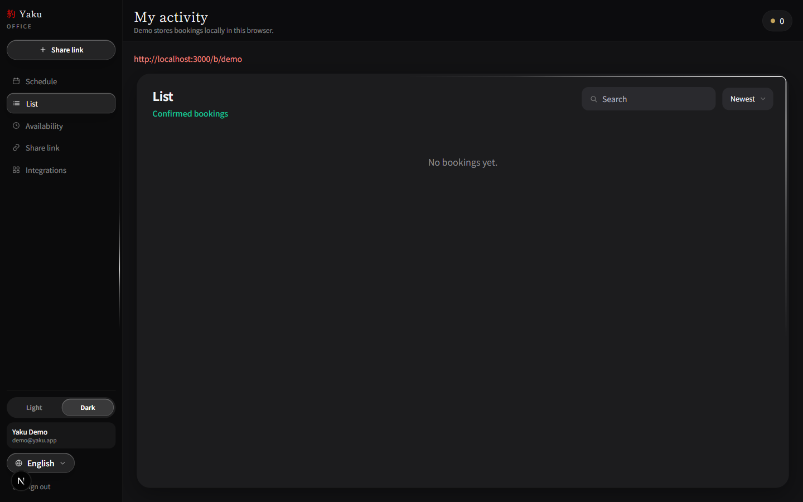

<p align="center">
  
</p>

<h1 align="center">Yaku (約)</h1>

<p align="center">
  <strong>Open-source scheduling</strong> — a lightweight Calendly alternative.<br />
  Bookings, host office, and a public link — without the bloat.
</p>

<p align="center">
  <a href="https://github.com/canyando4699-pixel/yaku">GitHub</a>
  ·
  UI: <strong>English</strong> (DE / JA available)
</p>

**約 (yaku)** means agreement / appointment / a promise kept.

---

## One appointment. No bloat.

Yaku turns open time into real appointments. Guests pick a type, date, and slot on your booking link. Hosts manage everything in a dark/light **office dashboard** — schedule, list, availability, and share.

Lightweight, open source, self-hostable. Local-first for the demo; backend can move to Supabase later.

---

## Preview

### Landing

Atmospheric Fuji hero with the 約 brand and a clear path into the demo.



Calendar preview on the landing page:



### Guest booking

Public booking flow (`/b/demo`) with event types, timezone, date, and time slots — liquid-glass card on a temple night backdrop.



### Host office

Host dashboard (`/host`) with theme toggle, language switcher, and liquid-glass UI:

| Schedule | List |
| --- | --- |
|  |  |

| Availability | Share link |
| --- | --- |
|  |  |

### Sign in

Local auth for the demo host account:


---

## What’s included

Early MVP — default UI language **English** (DE / JA via switcher):

- **Landing** — hero + calendar preview
- **Guest booking** (`/b/demo`) — event types, guest timezone, weekly series option
- **Guest manage** (`/b/demo/m/[bookingId]`) — cancel / reschedule + `.ics` download
- **Local auth** (`/login`, `/signup`) — demo: `demo@yaku.app` / `yaku123`
- **Host office** (`/host`)
  - **Schedule** — Fantastical-style day / week / month / year calendar
  - **List** — searchable booking table
  - **Availability** — weekdays, hours, buffers, notice, max/day, event types, series
  - **Share link** — copy / open public booking URL
  - **Integrations** — placeholder for Google / Apple calendar
  - Dark / light theme + liquid-glass controls
- **Local-first** storage in the browser (replaceable with Supabase later)

---

## Develop

```bash
cp .env.example .env.local
npm install
npm run dev
```

Open [http://localhost:3000](http://localhost:3000). Host office: [http://localhost:3000/host](http://localhost:3000/host) after sign-in.

---

## Security / GitHub

**Do not commit or push:**

- `.env`, `.env.local`, or any real env files
- API keys, database URLs, service-account JSONs
- Private certificates (`*.pem`, `*.key`)

Only `.env.example` with placeholders belongs in the repo. Before every push:

```bash
git status
git diff
```

If unsure: **do not** stage the file.
