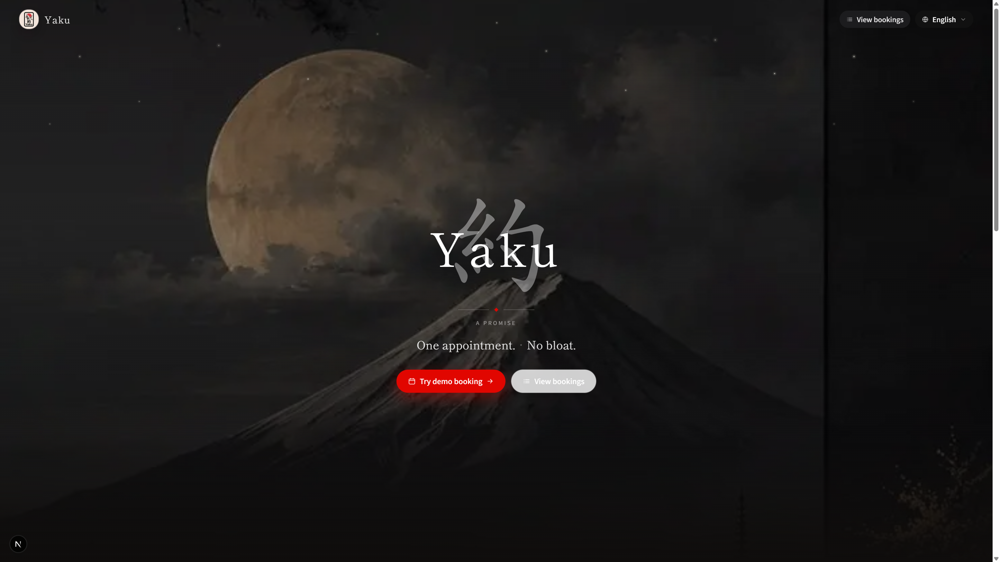

<p align="center">
  
</p>

<h1 align="center">Yaku (約)</h1>

<p align="center">Open-source scheduling — a lightweight alternative to Calendly.</p>

<p align="center">
  <a href="https://github.com/canyando4699-pixel/yaku">GitHub</a>
</p>

**約 (yaku)** means agreement / appointment / a promise kept.

## Preview

### Hero


### Calendar section


### Demo booking flow


## Tagline

**One appointment. No bloat.**

Yaku turns open time into real appointments. Lightweight, open source, self-hostable — a booking link without the lock-in.

## Status

Early MVP:

- Public demo booking link (`/b/demo`)
- Weekday availability + 30-min slots
- Booking with name / email (+ `.ics` download)
- Simple host list (`/host`, localStorage)

## Develop

```bash
cp .env.example .env.local
npm install
npm run dev
```

## Security / GitHub

**Do not commit or push:**

- `.env`, `.env.local`, or any real env files
- API keys, database URLs, service-account JSONs
- Private certificates (`*.pem`, `*.key`)

Only `.env.example` with placeholders belongs in the repo. Before every push:

```bash
git status
git diff
```

If unsure: **do not** stage the file.
